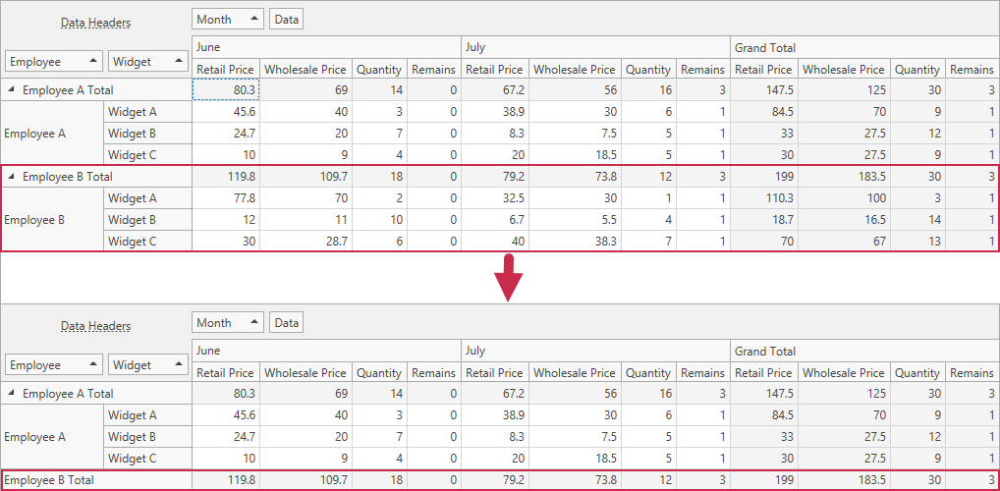

<!-- default badges list -->

<!-- default badges end -->

# Pivot Grid for WPF - How to Hide Specific Rows and Columns

The following example demonstrates how handle the [CustomFieldValueCells](https://docs.devexpress.com/WPF/DevExpress.Xpf.PivotGrid.PivotGridControl.CustomFieldValueCells) event to hide specific rows and columns. In this example, the event handler iterates through all row headers and removes rows that correspond to the "Employee B" field value, and that are not Total Rows.

## Files to Review

* [Data.cs](./CS/WpfApp/Data.cs) (VB: [Data.vb](./VB/WpfApp/Data.vb))
* [MainWindow.xaml](./CS/WpfApp/MainWindow.xaml) (VB: [MainWindow.xaml](./VB/WpfApp/MainWindow.xaml))
* [MainWindow.xaml.cs](./CS/WpfApp/MainWindow.xaml.cs) (VB: [MainWindow.xaml.vb](./VB/WpfApp/MainWindow.xaml.vb))

## More Examples 

- [Pivot Grid for WinForms - How to Hide Specific Rows and Columns](https://github.com/DevExpress-Examples/winforms-pivot-grid-hide-specific-columns-and-rows)
<!-- feedback -->
## Does this example address your development requirements/objectives?

 

(you will be redirected to DevExpress.com to submit your response)
<!-- feedback end -->
